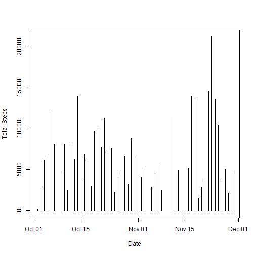
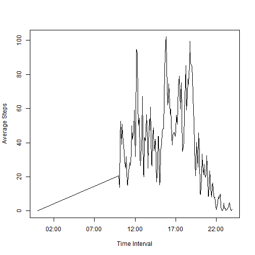
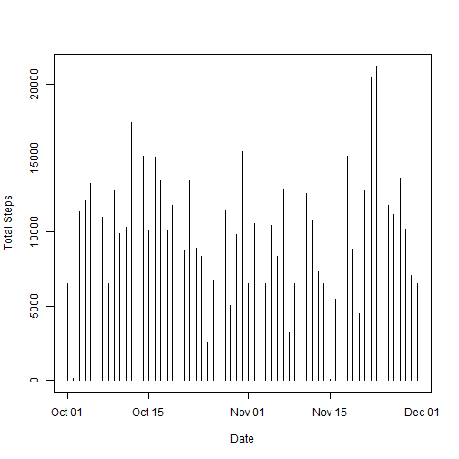
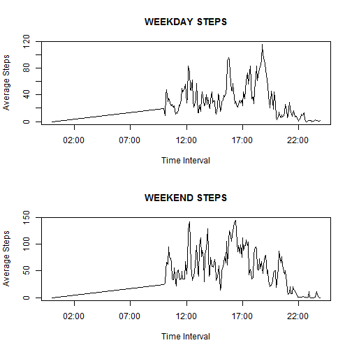

This is Peer Assessment 1 for Coursera's "Reproducible Research" course. This pdf was created from an R Markdown document.


## Loading and preprocessing the data
Read the activity.csv file, create a POSIXct datetime field, and cast the date from integer to type date.


```r
library(plyr)
activity <- read.csv("data/activity.csv", header=TRUE, na.strings="NA")
activity$datetime <- as.POSIXct(strptime(paste(activity$date, " ", 
   substr(activity$interval, 1, 2), ":", substr(activity$interval, 3, 4), ":00", 
   sep=""), "%Y-%m-%d %H:%M"))
activity$date <- as.Date(activity$date)
```


## What is mean total number of steps taken per day?
For this part of the assignment, you can ignore the missing values in the dataset.

1.Make a histogram of the total number of steps taken each day


```r
completes <- activity[complete.cases(activity),]
stepsbydate <- data.frame(totalsteps = (aggregate(completes$steps, 
    by=list(completes$date), FUN=sum, na.rm = TRUE)))
colnames(stepsbydate) <- c("date", "totalsteps")
plot(stepsbydate$date, stepsbydate$totalsteps, type="h", xlab="Date", 
    ylab="Total Steps")
```

 

2.Calculate and report the mean and median total number of steps taken per day


```r
stepsbydate <- data.frame(meansteps = (aggregate(completes$steps, 
    by=list(completes$date), FUN=mean, na.rm = TRUE)),
    mediansteps = aggregate(completes$steps, by=list(completes$date), 
    FUN=median, na.rm = TRUE)[2])
colnames(stepsbydate) <- c("Date", "Mean Steps", "Median Steps")
stepsbydate
```

```
##          Date  Mean Steps Median Steps
## 1  2012-10-02   0.6666667            0
## 2  2012-10-03  14.9365079            0
## 3  2012-10-04  32.2169312            0
## 4  2012-10-05  35.7936508            0
## 5  2012-10-06  64.0105820            0
## 6  2012-10-07  43.1640212            0
## 7  2012-10-09  25.0158730            0
## 8  2012-10-10  42.8412698            0
## 9  2012-10-11  13.2169312            0
## 10 2012-10-12  42.3174603            0
## 11 2012-10-13  33.4761905            0
## 12 2012-10-14  73.6137566            0
## 13 2012-10-15  18.6243386            0
## 14 2012-10-16  36.1746032            0
## 15 2012-10-17  32.3756614            0
## 16 2012-10-18  15.8941799            0
## 17 2012-10-19  51.1269841            0
## 18 2012-10-20  52.6772487            0
## 19 2012-10-21  41.3015873            0
## 20 2012-10-22  59.5714286            0
## 21 2012-10-23  37.6931217            0
## 22 2012-10-24  40.4708995            0
## 23 2012-10-25  11.6984127            0
## 24 2012-10-26  22.5396825            0
## 25 2012-10-27  24.6613757            0
## 26 2012-10-28  34.9576720            0
## 27 2012-10-29  17.2910053            0
## 28 2012-10-30  46.8253968            0
## 29 2012-10-31  34.7301587            0
## 30 2012-11-02  21.8201058            0
## 31 2012-11-03  28.1640212            0
## 32 2012-11-05  14.9735450            0
## 33 2012-11-06  25.3227513            0
## 34 2012-11-07  29.4444444            0
## 35 2012-11-08  13.0317460            0
## 36 2012-11-11  59.9894180            0
## 37 2012-11-12  23.5132275            0
## 38 2012-11-13  26.2698413            0
## 39 2012-11-15   0.0000000            0
## 40 2012-11-16  27.6349206            0
## 41 2012-11-17  73.6137566            0
## 42 2012-11-18  71.4550265            0
## 43 2012-11-19   8.2539683            0
## 44 2012-11-20  15.4920635            0
## 45 2012-11-21  19.6719577            0
## 46 2012-11-22  77.3492063            0
## 47 2012-11-23 112.1375661            0
## 48 2012-11-24  71.8624339            0
## 49 2012-11-25  55.0582011            0
## 50 2012-11-26  19.7354497            0
## 51 2012-11-27  26.3915344            0
## 52 2012-11-28  11.2380952            0
## 53 2012-11-29  24.9682540            0
```

## What is the average daily activity pattern?

1.Make a time series plot (i.e.  type = "l" ) of the 5-minute interval (x-axis) and the average number of steps taken, averaged across all days (y-axis)

```r
library(scales)
completes <- activity[complete.cases(activity),]
stepsbytimeint <- data.frame(avgsteps = (aggregate(completes$steps, 
    by=list(format(completes$datetime, "%H:%M")), FUN=mean, na.rm = TRUE)))
colnames(stepsbytimeint) <- c("timeint", "avgsteps")
stepsbytimeint$timeint <- as.POSIXct(strptime(stepsbytimeint$timeint, "%H:%M"))
plot(stepsbytimeint$timeint, stepsbytimeint$avgsteps, type="l",
    xlab="Time Interval", ylab="Average Steps")
```

 

2.Which 5-minute interval, on average across all the days in the dataset, contains the maximum number of steps?


```r
format(stepsbytimeint[stepsbytimeint$avgsteps == max(stepsbytimeint$avgsteps),1]
       ,"%H:%M")
```

```
## [1] "15:50"
```

## Imputing missing values
Note that there are a number of days/intervals where there are missing values (coded as NA). The presence of missing days may introduce bias into some calculations or summaries of the data.

1.Calculate and report the total number of missing values in the dataset (i.e. the total number of rows with  NA s)

```r
nrow(activity[!complete.cases(activity),])
```

```
## [1] 7551
```

2.Devise a strategy for filling in all of the missing values in the dataset. The strategy does not need to be sophisticated. For example, you could use the mean/median for that day, or the mean for that 5-minute interval, etc.

Strategy is to take the mean of steps by time of day.

3.Create a new dataset that is equal to the original dataset but with the missing data filled in.

```r
all <- activity
completes <- activity[complete.cases(activity),]
ivals <- ddply(completes, .(interval), summarize, meanbyint=as.integer(mean(steps)))
all <- join(activity, ivals)
```

```
## Joining by: interval
```

```r
all$steps <- ifelse(is.na(all$steps), all$meanbyint, all$steps)
```

4.Make a histogram of the total number of steps taken each day and Calculate and report the mean and median total number of steps taken per day. Do these values differ from the estimates from the first part of the assignment? What is the impact of Imputing missing data on the estimates of the total daily number of steps?

```r
stepsbydate <- data.frame(totalsteps = (aggregate(all$steps, by=list(all$date), 
    FUN=sum, na.rm = TRUE)))
colnames(stepsbydate) <- c("date", "totalsteps")
plot(stepsbydate$date, stepsbydate$totalsteps, type="h", xlab="Date", 
    ylab="Total Steps")
```

 

```r
stepsbydate <- data.frame(meansteps = (aggregate(all$steps, by=list(all$date), 
    FUN=mean, na.rm = TRUE)), mediansteps = aggregate(all$steps, by=list(all$date),
    FUN=median, na.rm = TRUE)[2])
colnames(stepsbydate) <- c("Date", "Mean Steps", "Median Steps")
stepsbydate
```

```
##          Date Mean Steps Median Steps
## 1  2012-10-01 34.5767196           35
## 2  2012-10-02  0.4375000            0
## 3  2012-10-03 39.4166667            0
## 4  2012-10-04 42.0694444            0
## 5  2012-10-05 46.1597222            0
## 6  2012-10-06 53.5416667            0
## 7  2012-10-07 38.2465278            0
## 8  2012-10-08 34.5767196           35
## 9  2012-10-09 44.4826389            0
## 10 2012-10-10 34.3750000            0
## 11 2012-10-11 35.7777778            0
## 12 2012-10-12 60.3541667            0
## 13 2012-10-13 43.1458333            0
## 14 2012-10-14 52.4236111            0
## 15 2012-10-15 35.2048611            0
## 16 2012-10-16 52.3750000            0
## 17 2012-10-17 46.7083333            0
## 18 2012-10-18 34.9166667            0
## 19 2012-10-19 41.0729167            0
## 20 2012-10-20 36.0937500            0
## 21 2012-10-21 30.6284722            0
## 22 2012-10-22 46.7361111            0
## 23 2012-10-23 30.9652778            0
## 24 2012-10-24 29.0104167            0
## 25 2012-10-25  8.6527778            0
## 26 2012-10-26 23.5347222            0
## 27 2012-10-27 35.1354167            0
## 28 2012-10-28 39.7847222            0
## 29 2012-10-29 17.4236111            0
## 30 2012-10-30 34.0937500            0
## 31 2012-10-31 53.5208333            0
## 32 2012-11-01 34.5767196           35
## 33 2012-11-02 36.8055556            0
## 34 2012-11-03 36.7048611            0
## 35 2012-11-04 34.5767196           35
## 36 2012-11-05 36.2465278            0
## 37 2012-11-06 28.9375000            0
## 38 2012-11-07 44.7326389            0
## 39 2012-11-08 11.1770833            0
## 40 2012-11-09 34.5767196           35
## 41 2012-11-10 34.5767196           35
## 42 2012-11-11 43.7777778            0
## 43 2012-11-12 37.3784722            0
## 44 2012-11-13 25.4722222            0
## 45 2012-11-14 34.5767196           35
## 46 2012-11-15  0.1423611            0
## 47 2012-11-16 18.8923611            0
## 48 2012-11-17 49.7881944            0
## 49 2012-11-18 52.4652778            0
## 50 2012-11-19 30.6979167            0
## 51 2012-11-20 15.5277778            0
## 52 2012-11-21 44.3993056            0
## 53 2012-11-22 70.9270833            0
## 54 2012-11-23 73.5902778            0
## 55 2012-11-24 50.2708333            0
## 56 2012-11-25 41.0902778            0
## 57 2012-11-26 38.7569444            0
## 58 2012-11-27 47.3819444            0
## 59 2012-11-28 35.3576389            0
## 60 2012-11-29 24.4687500            0
## 61 2012-11-30 34.5767196           35
```

## Are there differences in activity patterns between weekdays and weekends?
For this part the  weekdays()  function may be of some help here. Use the dataset with the filled-in missing values for this part.

1.Create a new factor variable in the dataset with two levels -- "weekday" and "weekend" indicating whether a given date is a weekday or weekend day.

```r
all$date <- as.Date(all$date)
all$dayofweek <- factor(weekdays(all$date))
all$daytype <- ifelse(all$dayofweek == "Saturday" | all$dayofweek == "Sunday",
    "weekend", "weekday")
all$daytype <- factor(all$daytype)
```

2.Make a panel plot containing a time series plot (i.e.  type = "l" ) of the 5-minute interval (x-axis) and the average number of steps taken, averaged across all weekday days or weekend days (y-axis). The plot should look something like the following, which was created using simulated data:


```r
all$datetime <- as.POSIXct(strptime(paste(all$date, " ", 
    substr(all$interval, 1, 2), ":", substr(all$interval, 3, 4), ":00", sep=""), 
    "%Y-%m-%d %H:%M"))
weekdayactivities <- all[all$daytype == "weekday",]
weekendactivities <- all[all$daytype == "weekend",]
par(mfrow=c(2,1))

# Create data and plot for weekdays
weekdaystepsbytimeint <- data.frame(avgsteps = (aggregate(weekdayactivities$steps, 
    by=list(format(weekdayactivities$datetime, "%H:%M")), FUN=mean, na.rm = TRUE)))
colnames(weekdaystepsbytimeint) <- c("timeint", "avgsteps")
weekdaystepsbytimeint$timeint <- as.POSIXct(strptime(weekdaystepsbytimeint$timeint,
    "%H:%M"))
plot(weekdaystepsbytimeint$timeint, weekdaystepsbytimeint$avgsteps, type="l",
    xlab="Time Interval", ylab="Average Steps", main="WEEKDAY STEPS")

# Create data and plot for weekends
weekendstepsbytimeint <- data.frame(avgsteps = (aggregate(weekendactivities$steps, 
    by=list(format(weekendactivities$datetime, "%H:%M")), FUN=mean, na.rm = TRUE)))
colnames(weekendstepsbytimeint) <- c("timeint", "avgsteps")
weekendstepsbytimeint$timeint <- as.POSIXct(strptime(weekendstepsbytimeint$timeint,
    "%H:%M"))
plot(weekendstepsbytimeint$timeint, weekendstepsbytimeint$avgsteps, type="l",
    xlab="Time Interval", ylab="Average Steps", main="WEEKEND STEPS")
```

 
